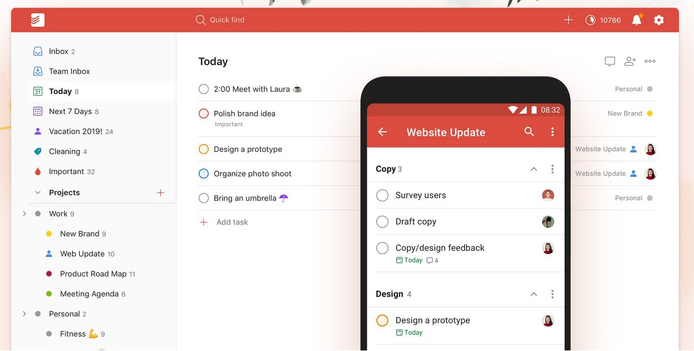

============================================================================================
============================================================================================

 # WhaToDo 
 ## ToDoList Web App.

 ######      Created By Gil Dankner - Danks / DGorgula

============================================================================================
============================================================================================

# A word to conclude the project

it's been a really great work, the challenges really took me to my limits in a variaty of ways: Planning and attempting to calculate times for tasks, rethinking of right stages up to the complete project, lots of debugging and deeper perception of JS, learning to work with new workaround in limit time, and working sharply with a really small emount of time.

## my planned working Timeline:

Wednesday:

- accomplish all tests.
- connect the project to jsonbin.
- lookup for features I like in different apps and ToDoList projects available online.

Thursday:

- create tests to the new features I'd like to add.
- start adding features

Friday:

- complete the features I wanted to add
- lookup for nice styling and element placements, both for desktop and mobile.
- begin styling.

Saturday:

- finish styling.

Sunday:

- present the project to 3 different friends and take feedback
- fix project with conclusions from feedback.

Monnday:

- check and correct function size and division
- check and correct indentation, names, comments and documentation.
- record submission video.
- submit as required.

# First steps into the project

I started the project first hours by planning and dividing the work to each day, and for that I had to go through the right stages to build a project.
I fount it the best to begin with the basic requirements. I thought that just a moment before I rush towards the shining part of the Features, it would be wiser to build some tests, so I can check the work I do as I do it, and also because that way I could get the most out of the experience.
And I would build the tests to test and not to pass.
It wasnt easy, and it is no perfect, but the JsonBin and the tests building took me much more time than I expected. And so I took my step forward to the features. I did a review, and found multiple idea i liked from multiple sites, apps, and projects.

### focus on 'Add Task Input' from app load and back from anything else.

I believe this was one of the first feature I built in the project.
The Idea is to make the User Interface as fast and as easy as possible.
To do so, on program load the 'Add Task Input' would first be focused and ready to start typing. And from that moment and on you can easily go back there by 'Escape' button.
Further more, after every action you take the 'Add Task Input' will be focused and good to go again.
You can use this feature by:
1. Load the Web App.
2. Press 'Escape' anytime and anywhere in the app.

## Task Types

I worked with the concept of 'Keep all information', To do so the program distinguishes between your Relevant, Deleted or Completed Tasks.
On load the program would show all Tasks including Completed and Deleted Task.
(This wasnt changed due to the built-in tests - the filtering made the test exceed its time limit).
As soon as you press key of any kind(perhaps ':' excluded, explained later in this README) the program will refresh its containers to show only the Relevant Tasks.
This feature can be found by:
1. Menu buttons('Deleted' for Deleted Tasks, etc.).
2. Keyboard-Mode Keysets:
 - ':md' stands for: Menu > Deleted.
 - ':mc' stands for: Menu > Completed

As mentioned before 'Escape' will take you back to Relevant Tasks.

<!-- delete button changes its functionality to restore button -->

## 'Enter' to add item.

This feature purpose is to make the User Interface as fast and as easy as possible.
On 'Enter' keypress while the focus is on the 'Add Task Input',
the app will add the its value to as a new Task.

notice the app will not add an empty Task, and alert will show up to guide you to enter a value for your new task.

This feature can be found by:
1. 'Enter' while focus on 'Add Task Input'.

## multiple item adding seperated by `,` or something else

This is one more solution to create the most handful and convenient User Interface, and it is the last feature I programmed.
This feature allows you To add multiple values at once.
The app will recieve any Task Input, and if it contain commas (',', one or more) any value before and after it will be added as a new Task.
For example:
The Input 'Feed the dog, Go shopping, Bring peace to the world'
would add the Tasks:
 - 'Feed the dog'
 - 'Go shopping'
 - 'Bring peace to the world'

Notice that there is nothing to be worried about the spaces before or after the values,
for they will be trimmed.

 You can use this feature by:
 1. Adding any values seperated by comma to the 'Add Task Input'. (':' excluded - explained later in this README).

## Search

I made every key pressed to the 'Add Task Input' filtering the current displayed tasks.
If the Task value contain the 'Add Task Input' value, it will be presented.
<!-- -- gif -- -->
You can use this feature by:
1. Typing the value you wish to find to the 'Add Task Input'.

## menu for navigation

Simple as it sound, menu that contains a few buttons for each Task Type(Deleted, Completed, etc.)
You can use this feature by:
1. Menu buttons('Deleted' for Deleted Tasks, etc.).
2. Keyboard-Mode Keysets:
 - ':md' stands for: Menu > Deleted.
 - ':mc' stands for: Menu > Completed

## Real-Time Navigation Bar

The Real-Time Navigation Bar appear above the menu in big gray letters.
It will show you on Real-Time what tasks are presented in the page.
It is built in this pattern - '> Page > Filtering-Value'
For example:
'> Deleted > love'
Will show all Deleted Tasks contains a word starting with 'love'(such as 'love of my life', 'sing along the lovebirds', etc.)

the 'Filtering-Value' is pulled from the 'Add Task Input'(see more on [Search](##Search) feature. )

## Important Task Type

Another [Task Type](##Task-Types), that refer to every task with priority of 3 and above.
All Important Tasks are to found by:
1. 'Important' Menu link.
2. Keyboard-Mode Keyset ':mi' (stands for: Menu > Important.)

## Keyboard Mode Keyset

Set of keyboard shortcuts to navigate and make actions fast and easily.
The feature lets you do anything the keyboard alone.(sadly, mark Task as done excluded, will be added as soon as possible).
The actions will be made on all presented Tasks.

You can use this feature by:
1. Keyboard-Mode Keysets:
 - ':k' stands for Keyset - open the Keyboard-Mode Keyset.
 - ':md' stands for: Menu > Deleted - show all Deleted Tasks
 - ':mc' stands for: Menu > Completed - show all Completed Tasks
 - ':mi' stands for: Menu > Important - show all Important Tasks

# styling

This part as before, began with a review to find designs and themes I
like, I ended up with a photo of a site I took my insperation of a picture I found online:  

